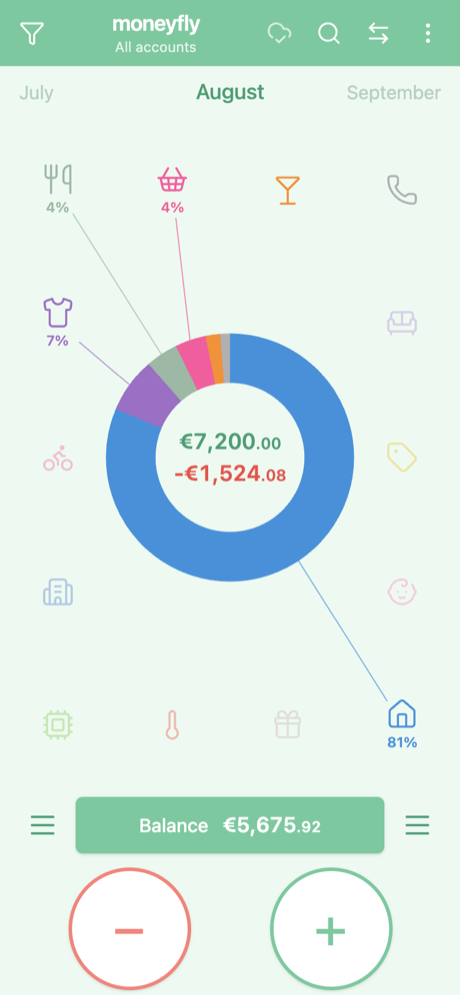
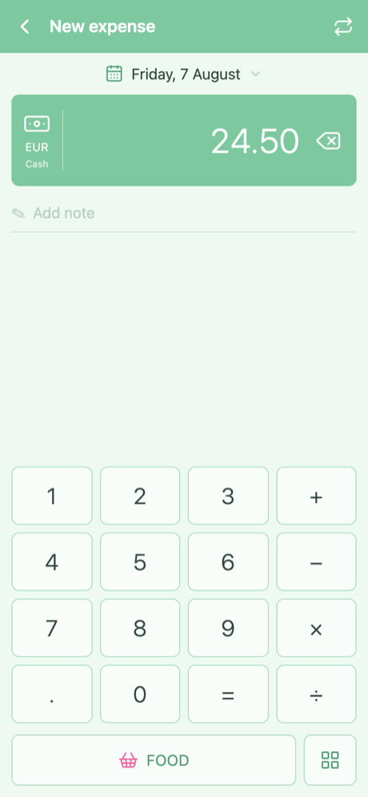
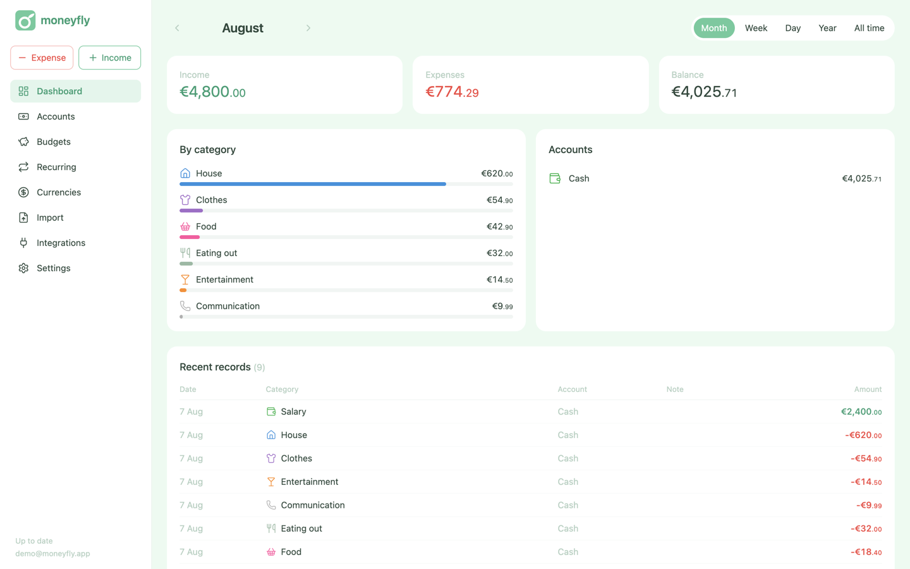
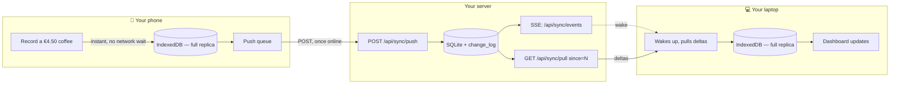

<p align="center">
  
</p>

<h1 align="center">moneyfly</h1>

<p align="center">Self-hosted expense tracking that syncs across your devices. One command to setup, PWA for online/offine iOS/Android usage.</p>

<p align="center">
  <a href="https://github.com/antlko/moneyfly/pkgs/container/moneyfly"></a>
  
  <a href="LICENSE"></a>
</p>

<p align="center">
  
  
</p>
<p align="center"><sub>Mobile dashboard &nbsp;&nbsp;·&nbsp;&nbsp; Best easy record flow</sub></p>

<p align="center">
  
</p>
<p align="center"><sub>Desktop analytics dashboard</sub></p>

---

> **Status: usable.** Install it, record spending in three taps, switch periods, run accounts and
> transfers in several currencies, edit and search, set budgets and recurring records, import a
> Monefy export, export, integrate or script against your own data, and get a real analytics
> dashboard on a wider screen — all of it working with no connection, syncing when one returns. A
> few PWA niceties (dark theme, a PIN lock) are still to come. See [the roadmap](#roadmap).

moneyfly is a personal expense tracker you run yourself. One container, one data directory, no
account with anyone else. On a phone it works the way Monefy does, because that design is hard to
beat for the one thing that matters: a spend takes three taps — tap `−`, type the amount, pick the
category. On a wide screen the same app becomes an analytics dashboard. Your data lives on your
server and in your browser, and nowhere else.

## Why

- **Self-hosted, with real sync.** One binary, one SQLite file, one directory to back up. Devices
  sync through your server — no Google Drive, no Dropbox, no vendor.
- **Works offline.** The phone writes to local storage first and syncs in the background, so
  recording a coffee in a basement café works exactly as well as at home.
- **Installs like an app.** It is a PWA: Add to Home Screen on iOS or Android and it runs
  full-screen with its own icon. There is no native app to install and none is planned.
- **Your data stays exportable.** CSV export, in this app's own shape or a Monefy-compatible one, so
  you can leave as easily as you arrived. API tokens and webhooks are there for anything scripted.

## Quick start

moneyfly ships as a **single container** — pick whichever route is easiest, each block is
copy-paste ready.

### Option A — `docker run`

```bash
docker run -d --name moneyfly -p 5007:5007 -v moneyfly-config:/config ghcr.io/antlko/moneyfly:latest
```

### Option B — Docker Compose

Save this as `docker-compose.yml` (or copy [the one in this repo](docker-compose.yml)) and run
`docker compose up -d`:

```yaml
services:
  moneyfly:
    image: ghcr.io/antlko/moneyfly:latest
    container_name: moneyfly
    restart: unless-stopped
    ports:
      - '5007:5007'
    volumes:
      - moneyfly-config:/config

volumes:
  moneyfly-config:
```

### Option C — Portainer (stack)

1. **Stacks → Add stack**, give it a name (e.g. `moneyfly`).
2. Paste the Compose file from Option B into the **Web editor**.
3. Click **Deploy the stack**.
4. Browse to `http://<your-server>:5007` and finish setup.

Nothing to build — the image is pulled from GHCR.

### Option D — Build from source

```bash
git clone https://github.com/antlko/moneyfly.git
cd moneyfly
docker compose up -d --build   # uncomment the `build:` stanza in docker-compose.yml first
```

---

Open <http://localhost:5007> — **the first account you create claims the instance and becomes the
admin.**

## Install it as an app

moneyfly is a PWA: once your instance is running, install it like a native app on your phone —
your own icon, full-screen, no browser chrome. Every action you take from then on — recording a
spend, editing a category, setting a budget — is written to your device instantly and queued to
sync with your server in the background, online or off. It reaches every other device signed into
the same account the same way. See **[How sync works](#how-sync-works)** below for exactly what
that means and what does or doesn't sync.

**Android (Chrome)**

1. Open your instance's URL in Chrome and sign in.
2. Tap the **⋮** menu → **Install app** (or tap the install icon Chrome shows in the address bar).
3. Confirm. moneyfly appears on your home screen and in the app drawer.

**iOS (Safari)**

1. Open your instance's URL in **Safari** — installation only works from Safari; every other iOS
   browser sits on the same engine but doesn't expose the install action.
2. Sign in.
3. Tap the **Share** icon → **Add to Home Screen** → **Add**.

**Self-hosting: HTTPS is required to install.** Service workers — what makes the app installable
and usable offline — only register over HTTPS or on `localhost`, so `http://192.168.x.x` will
never offer "Add to Home Screen" on either platform. Put your instance behind a reverse proxy that
terminates TLS — [Caddy](https://caddyserver.com), [Tailscale Serve](https://tailscale.com/kb/1242/tailscale-serve),
or anything else — in front of `:5007`.

## How sync works

Every device — phone, laptop, a second phone — keeps a **full local replica** of your accounts,
categories, transactions, budgets and recurring rules in its own IndexedDB. The UI always reads
from that replica, never from the network, which is what makes recording a spend with no signal
work exactly like recording one at home:



Full protocol — the exact wire format, retry rules, bootstrap and every conflict scenario — is
documented in **[docs/SYNC.md](docs/SYNC.md)**. The short version:

- **What syncs.** Five kinds of row travel through this op-log: `account`, `category`, `txn`
  (expenses, income and transfers), `budget` and `recurring_rule`. Each carries a Lamport counter,
  the id of the device that last wrote it, and a `deleted` tombstone flag — rows are never hard
  `DELETE`d, because a hard delete can't propagate to a device that hasn't seen it yet.
- **How a conflict resolves.** Every row's version is the pair `(lamport, device_id)`. The higher
  lamport wins outright; on a tie, the lexicographically greater `device_id` wins. That rule runs
  identically on the client and the server, so applying the same op twice is always a no-op and the
  outcome never depends on which device's push happens to land first — any interleaving of the same
  edits converges to the same state. It's last-write-wins **per row, not per field**, which is safe
  here specifically because an account's balance is never stored: it's derived by summing that
  account's transactions on every read, so there is no running counter an overwritten edit could
  desync.
- **Bootstrapping a new device.** It never starts from "everything since the beginning" —
  the server's `change_log` is trimmed by `sync.change_log_retention_days`, so that would silently
  return an incomplete history. Instead a new device calls `GET /api/sync/snapshot` once for every
  current row plus a cursor, then follows only the deltas after that. A device that's been offline
  longer than retention gets a `409 resync required` on its next pull and re-bootstraps the same
  way.
- **What does *not* sync.** Three tables sit deliberately outside the op-log, because none of them
  is a domain row that belongs on every device:
  - **Exchange rates** (`fx_rate`) — a fact about the world, not about a user. The server fetches
    them from providers once a day; every client pulls the same table read-only over plain REST
    into its own cache, never through the sync engine.
  - **Integrations** (`api_token`, `webhook`) — a token or a webhook secret describes how *this
    account* is reached from outside. It's held once, in the server's SQLite, and never replicated
    to a device.
  - **`config.yaml`** — instance infrastructure: listen address, OIDC providers, the FX provider
    chain. It's a file a human edits on the server; there's deliberately no API endpoint that even
    reads it back, let alone syncs it.

## Configuration

Everything lives in one **config directory**, mounted at `/config` in Docker:

```
/config
├── config.yaml     # infrastructure only: listen address, base URL, OIDC, FX, retention
├── moneyfly.db     # users, sessions, devices, every domain row, sync log — SQLite
└── exports/        # CSV exports written on request
```

Configuration is entirely optional — a missing `config.yaml` starts with sensible defaults. To
customise, copy [`config/config.example.yaml`](config/config.example.yaml) to `config/config.yaml`
and restart; every field is documented in [docs/CONFIGURATION.md](docs/CONFIGURATION.md).

| Variable | Default | Description |
| --- | --- | --- |
| `MONEYFLY_CONFIG_DIR` | `/config` | Where `config.yaml`, the database and exports live. |
| `MONEYFLY_ADDR` | `:5007` | Listen address (`host:port`). |
| `MONEYFLY_BASE_URL` | *empty* | Externally reachable origin. Required once an OIDC provider is configured. |
| `MONEYFLY_REGISTRATION` | `open` | `open` — anyone who can reach the instance may sign up. `closed` — set this once you've created your account. |
| `MONEYFLY_LOG_LEVEL` | `info` | `debug` \| `info` \| `warn` \| `error`. |

Command-line flags mirror the directory and address settings: `--config-dir` and `--addr`.

## How it works

One static Go binary embeds the built Vue app and serves both the API and the UI — the same code
runs the mobile flow and the desktop dashboard, no separate build.

- **Backend** — Go with [Fiber](https://gofiber.io) v3, SQLite (`config/moneyfly.db`), an
  operation-log sync engine with last-write-wins conflict resolution, and structured `slog` logging.
- **Frontend** — Vue 3 `<script setup>`, Pinia stores, Dexie for the on-device IndexedDB replica,
  Tailwind CSS v4.
- **Sync** — an operation-log engine with Lamport-clock conflict resolution; see
  [How sync works](#how-sync-works) above for the full picture.

## Development

```bash
make dev-api
```

```bash
make dev-ui
```

Two servers side by side: Go on `:5007`, Vite on `:5173` proxying `/api` to it. Full instructions,
including how to test sync between two devices, are in [docs/DEVELOPMENT.md](docs/DEVELOPMENT.md).

## Documentation

| Doc | Read it when you need |
| --- | --- |
| [docs/ARCHITECTURE.md](docs/ARCHITECTURE.md) | Data ownership, request flow, background workers |
| [docs/SYNC.md](docs/SYNC.md) | The op-log protocol, conflict resolution, bootstrap |
| [docs/MONEFY-PARITY.md](docs/MONEFY-PARITY.md) | The screen spec the mobile UI is measured against |
| [docs/API.md](docs/API.md) | Every endpoint + object shape |
| [docs/CONFIGURATION.md](docs/CONFIGURATION.md) | Every `config.yaml` field |
| [docs/DEVELOPMENT.md](docs/DEVELOPMENT.md) | Running both dev servers, building the single binary |

## Roadmap

| Phase | | |
| --- | --- | --- |
| 0 | Skeleton — build, serve, embed | ✅ |
| 1 | Accounts: password + OIDC sign-in | ✅ |
| 2 | Sync engine (offline-first op-log) | ✅ |
| 3 | Monefy dashboard and record screens | ✅ |
| 4 | Accounts, transfers, search, periods | ✅ |
| 5 | Multi-currency with daily FX rates | ✅ |
| 6–7 | Budgets, recurring records | ✅ |
| 8 | Monefy CSV import | ✅ |
| 9 | Export profiles, webhooks, API tokens | ✅ |
| 10 | Desktop analytics dashboard | ✅ |
| 11 | PWA polish, dark theme, PIN lock | ◐ installable & offline |

## Relationship to Monefy

moneyfly reproduces Monefy's screen layout and interaction flow, which is the part worth keeping.
It contains none of Monefy's artwork, wordmark or code, and is not affiliated with or endorsed by
its authors. Category icons come from [Lucide](https://lucide.dev).

## License

MIT — see [LICENSE](LICENSE).
