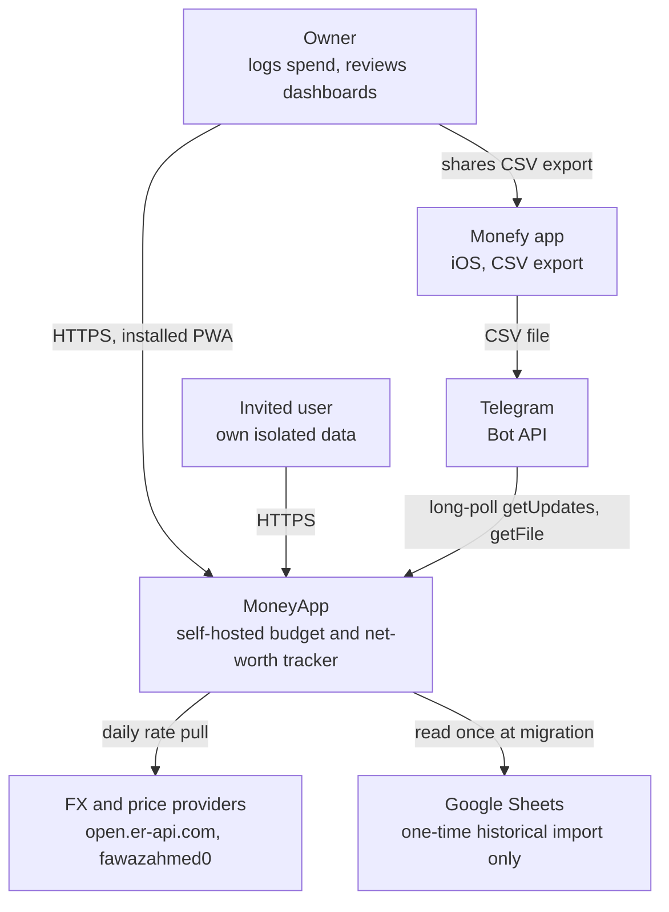
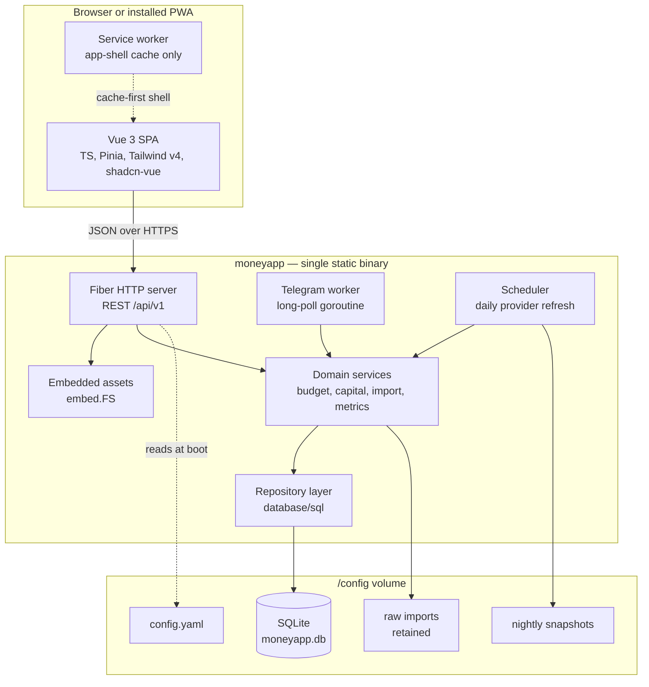
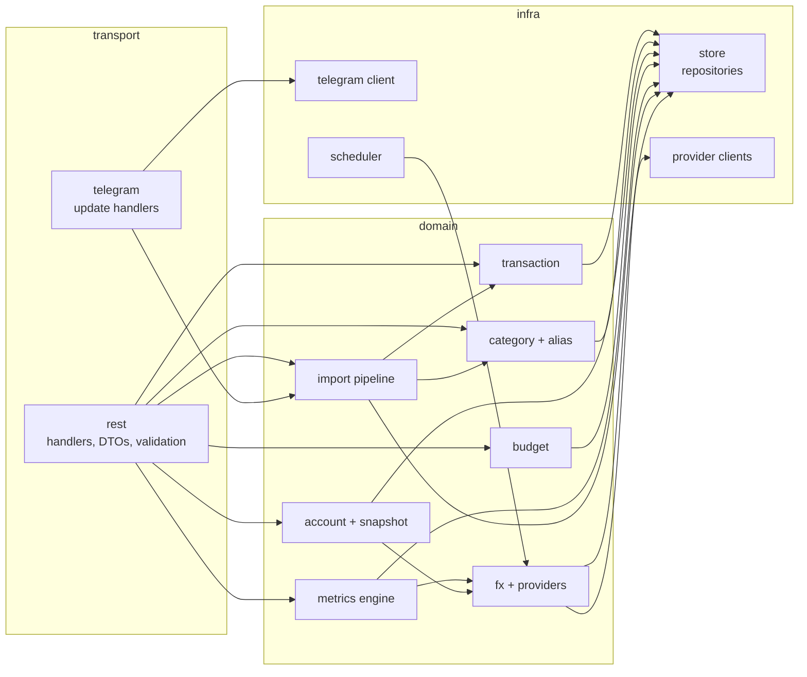
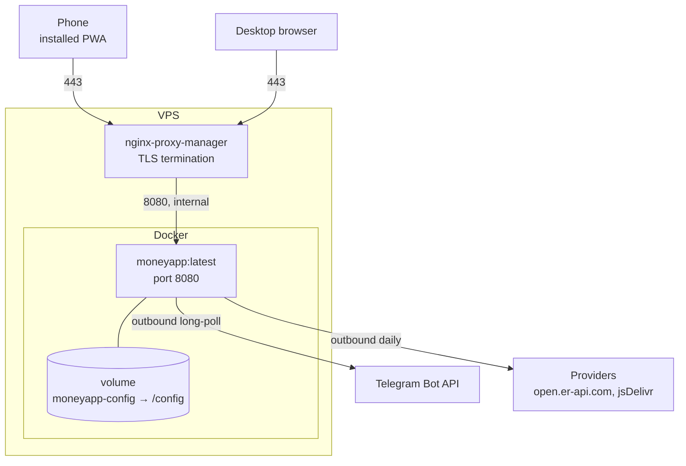
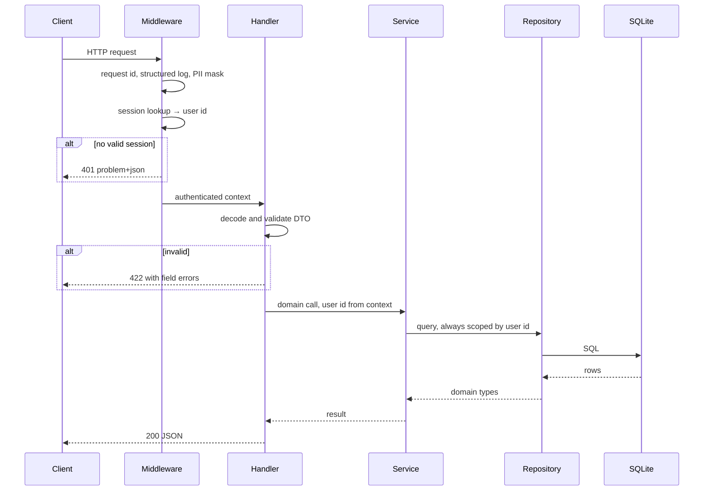

# 02 — Architecture

## 2.1 Shape

One Go binary. The Vue SPA is compiled and embedded via `embed.FS`. SQLite lives in a mounted `/config` volume. No sidecars, no external database, no CGO.

This is `upmonitor`'s deployment model with `golite`'s internals, chosen because it is already proven on the target server and reduces operating a personal finance app to `docker compose up -d`.

## 2.2 C4 Level 1 — System context



Note the ingestion asymmetry: the phone never talks to the server to import. It talks to Telegram, and the server pulls from Telegram. That is why long-polling is kept — no inbound endpoint has to be exposed for ingestion to work.

## 2.3 C4 Level 2 — Containers



### Why the bot is in-process

It shares the importer, the alias table and the database. A separate deployable would need either a duplicate of that logic or an internal API, and would double the operational surface for one user.

It is **optional and off by default** — one config key — and does exactly one thing: relay an uploaded file to the importer and return one reply. No reports, no queries, no notifications ([05](05-telegram-bot.md) §5.3).

The trade-off: a bot crash must not take down the web server. The worker runs under a supervising goroutine that logs, backs off and restarts, and never propagates a panic.

## 2.4 Internal structure



Rules:

- **Transport never touches `store`.** Handlers translate HTTP to domain calls and back.
- **Domain never imports transport.** No `fiber.Ctx` below `internal/transport`.
- **`metrics` is pure given its inputs.** Every spreadsheet formula is a function over loaded data, so it is directly unit-testable — this is what makes the parity tests possible.
- **Providers are interfaces.** A provider is a `RateProvider` implementation; adding one touches no domain code.

## 2.5 Repository layout

Follows `golite`, extended for the extra concerns.

```
moneyapp/
├── cmd/moneyapp/main.go          # wiring only
├── internal/
│   ├── config/                   # config.yaml + env, validated at boot
│   ├── transport/
│   │   ├── rest/                 # handlers, middleware, DTOs
│   │   └── telegram/             # update handlers, linking
│   ├── domain/
│   │   ├── transaction/
│   │   ├── category/             # incl. alias resolution
│   │   ├── account/              # incl. snapshots + reconciliation
│   │   ├── budget/
│   │   ├── metrics/              # the spreadsheet, as code
│   │   ├── importer/             # parse, map, dedup, reconcile
│   │   └── fx/                   # rates, providers, settings
│   ├── store/                    # repositories + queries
│   ├── provider/                 # erapi, fawazahmed
│   ├── scheduler/
│   └── platform/                 # logging, errors, money type
├── migrations/                   # goose
├── ui/                           # Vue 3 SPA
├── docs/
├── testdata/                     # real export + parity fixtures
├── Makefile
├── Dockerfile
├── docker-compose.yml
└── config.yaml.dist
```

## 2.6 Stack

| Concern | Choice | Why |
| --- | --- | --- |
| Language | **Go 1.25+** | Author's primary language; static binaries. 1.25, not the 1.23 first specified: `modernc.org/sqlite` and `goose` both declare `go 1.25` in their own `go.mod`, so an older toolchain cannot build them. The container build stage is `golang:1.25-alpine`. |
| HTTP | Fiber v2 | Used by both reference repos. v2 not v3 — v3 API is still settling. |
| DB | SQLite via `modernc.org/sqlite` | **Pure Go.** Keeps cross-compilation to arm64 trivial. |
| Migrations | goose | Both reference repos. |
| Queries | `database/sql` + hand-written SQL | Metrics are aggregate-heavy; an ORM obstructs. See [adr/0006](adr/0006-sql-not-orm.md). |
| Money | Integer minor units, custom type | Floats are already visibly wrong in the sheet. See [adr/0004](adr/0004-integer-money.md). |
| Logging | `log/slog` | Stdlib. Port `golite`'s PII-masking middleware. |
| Auth | Server-side sessions + bcrypt | `upmonitor`'s model. Simpler revocation than JWT. |
| Frontend | Vue 3 + TS + Pinia + Tailwind v4 | `upmonitor`'s stack. **shadcn-vue is not used yet**: stages 01–03 need buttons, inputs, selects and a keypad, all of which are a few Tailwind classes. Its primitives (`reka-ui`) earn their dependency when overlays arrive — dialogs, comboboxes, the import mapping screen in stage 04. Components live in `ui/src/components`, copied into the repo in the same spirit. |
| Charts | ECharts | Gradient area charts, drill-down doughnut, good dark mode. |
| Bot | `gotgbot/v2` | Already used and working. |
| Container | distroless static, amd64 + arm64 | `ghcr.io`. |

## 2.7 Deployment topology



TLS is terminated at the proxy, which already fronts other services on this host. The container publishes plain HTTP on 8080 and is never exposed directly.

## 2.8 Request lifecycle



`user_id` is taken **only** from the session, never from a request body or query parameter. Every repository method takes it as its first argument, so an unscoped query is visible in review.

## 2.9 Cross-cutting decisions

**Errors.** Domain returns typed sentinels; transport maps them to RFC 7807 `application/problem+json`. No `error` string is ever matched by substring.

**Time.** UTC everywhere in storage. A user timezone setting affects display and month-boundary attribution only.

**Money.** `Money{Amount int64, Currency string}`. Per-currency exponent — HUF is 0-decimal, EUR and USD are 2. Arithmetic across currencies is a compile-time-discouraged, runtime-refused operation: conversion must be explicit and carries the rate used.

**Configuration.** `config.yaml` in `/config` is authoritative; environment variables override individual keys. Validated at boot — the process refuses to start on an unusable config rather than failing later. See [10-deployment-ci.md](10-deployment-ci.md).

**Scoping.** Every table carries `user_id`. Enforced by convention plus a repository-layer test that fails if any query in `internal/store` omits a `user_id` predicate.

## 2.10 What is deliberately absent

| Absent | Rationale |
| --- | --- |
| Encryption at rest | [adr/0002](adr/0002-no-encryption.md) |
| Redis / cache | SQLite on local disk for one user is faster than a network hop. |
| Message queue | The only async work is a daily refresh and a long-poll loop. |
| Separate bot service | §2.3. |
| GraphQL | One known client. REST is sufficient and matches `golite`. |
| Postgres | SQLite suffices at this scale. Repository interfaces keep the door open without dialect-specific SQL. |
| Offline write queue | [adr/0012](adr/0012-defer-offline-entry.md) |
