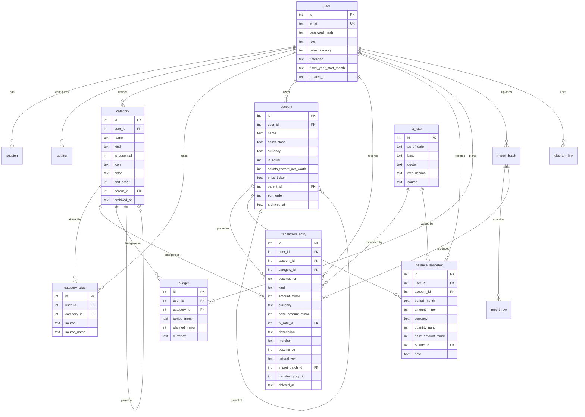
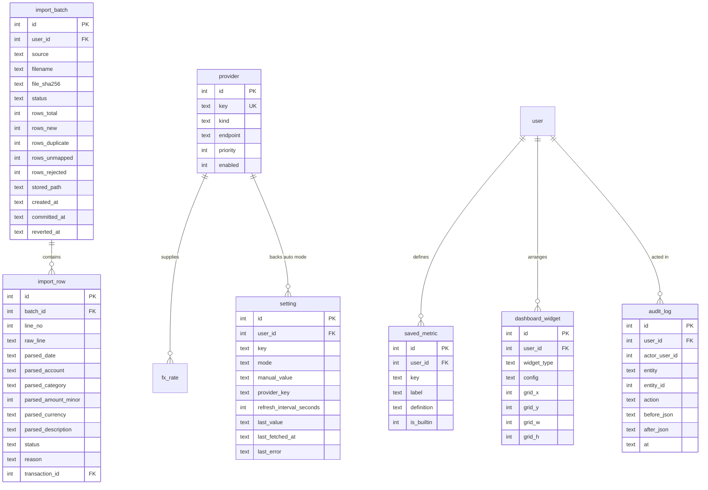

# 03 — Data Model

## 3.1 Design rules

1. **Every row is owned.** `user_id` on every user-facing table, always the first predicate.
2. **Money is integer minor units.** `amount_minor INTEGER` plus a currency code. Never `REAL`. See [adr/0004](adr/0004-integer-money.md).
3. **Conversions are recorded, not recomputed.** Anything stored in base currency also stores *which rate produced it*. This is what makes "was that a real saving or a currency move?" answerable — the spreadsheet cannot answer it.
4. **`NULL` means "not recorded".** The `-1` sentinel is gone. A recorded zero and an unrecorded month are different facts.
5. **Nothing is destroyed.** `deleted_at` soft-deletes; imports are reversible batches.
6. **Names are data.** Categories, accounts, aliases, budgets, thresholds and metric definitions are rows, so the flexibility goal needs no migrations.
7. **`STRICT` tables.** SQLite type affinity is off; a wrong type is an error at write time.

## 3.2 Core entities



## 3.3 Import and operations entities



Attribute blocks are drawn only where the columns carry design weight. `session`, `telegram_link`, `account_alias` and `currency` appear in relationships or prose without a block, to keep the diagrams readable; all four are fully specified in the DDL in §3.5, which is the authoritative definition.

## 3.4 Modelling notes

### Accounts replace the spreadsheet's fixed rows

Rows 36–51 and 65–69 become `account` rows, not columns:

| Spreadsheet row | `asset_class` | `is_liquid` | `price_ticker` |
| --- | --- | --- | --- |
| `Gold` | `metal` | 0 | `XAU` |
| `Cash USD` / `Cash EUR` / `Cash HUF` | `cash` | 1 | — |
| `Banks USD/EUR/HUF/UAH` | `bank` | 1 | — |
| `Banks FOP` | `bank` | 1 | — |
| `Deposits USD` / `Deposits EUR` | `deposit` | 0 | — |
| `Invests` | `investment` | 0 | — |
| `CSGO Skins` | `other` | 0 | — |
| `USDT (EUR)` | `crypto` | 0 | `USDT` |

`Cash` (row 37) and `Banks` (row 41) were **computed parents** in the sheet. They are not stored — they are `SUM` over children at query time, which removes the class of bug where a parent formula forgets a child. `Banks FOP` was omitted from `Banks` (41) but included in `General` (55); as a normal child of `Banks` it is now automatically in both.

`counts_toward_net_worth` reproduces the `Invests`/`Invested` distinction: current value counts, cost basis does not. Cost basis lives on the account as a separate `cost_basis_minor` figure so profit and loss is derivable without a phantom account.

### Metals and crypto: quantity or value

`balance_snapshot` accepts **either**:

- `amount_minor` — a value you assert directly (how the sheet works today), or
- `quantity_nano` — a holding, valued as `quantity × provider price`.

`CHECK` enforces exactly one. This lets `Gold` migrate from a retyped `3000` to `n` troy ounces priced daily from `XAU`, without a schema change, once the quantity is known (`TODO(anatol)`).

### Transfers

One `transaction` pair sharing a `transfer_group_id`, with `kind = 'transfer_out'` and `'transfer_in'`. Two rows rather than one keeps per-account balances a simple sum with no special case, and matches how a transfer appears in any statement. A transfer never touches category totals.

### Dedup

Monefy exports full history every time with no transaction ID, so `natural_key` is the SHA-256 of `occurred_on | account | category | amount_minor | currency | description`, and `occurrence` is a 1-based counter within that key on that date. Two identical coffees on the same day are `occurrence` 1 and 2 — both survive, while a re-import matches both and adds nothing.

`UNIQUE (user_id, natural_key, occurrence)` makes idempotency a database guarantee, not importer logic.

### Budgets

One row per category per month, so seasonal budgets work. Creating a year seeds 12 identical rows from one input — the UI never asks for 216 numbers.

## 3.5 DDL

Target SQLite 3.37+. `INTEGER` booleans, ISO-8601 `TEXT` dates, `TEXT` decimal strings for rates so no precision is lost.

```sql
PRAGMA foreign_keys = ON;
PRAGMA journal_mode = WAL;

CREATE TABLE currency (
    code        TEXT PRIMARY KEY,
    exponent    INTEGER NOT NULL,
    symbol      TEXT,
    name        TEXT NOT NULL
) STRICT;

CREATE TABLE user (
    id                       INTEGER PRIMARY KEY,
    email                    TEXT NOT NULL UNIQUE,
    password_hash            TEXT NOT NULL,
    display_name             TEXT,
    role                     TEXT NOT NULL DEFAULT 'user'
                                 CHECK (role IN ('admin','user','readonly')),
    base_currency            TEXT NOT NULL DEFAULT 'EUR' REFERENCES currency(code),
    timezone                 TEXT NOT NULL DEFAULT 'UTC',
    fiscal_year_start_month  INTEGER NOT NULL DEFAULT 8
                                 CHECK (fiscal_year_start_month BETWEEN 1 AND 12),
    created_at               TEXT NOT NULL,
    updated_at               TEXT NOT NULL,
    deleted_at               TEXT
) STRICT;

CREATE TABLE session (
    token_hash  TEXT PRIMARY KEY,
    user_id     INTEGER NOT NULL REFERENCES user(id) ON DELETE CASCADE,
    user_agent  TEXT,
    created_at  TEXT NOT NULL,
    expires_at  TEXT NOT NULL,
    revoked_at  TEXT
) STRICT;
CREATE INDEX idx_session_user ON session(user_id);

CREATE TABLE category (
    id            INTEGER PRIMARY KEY,
    user_id       INTEGER NOT NULL REFERENCES user(id) ON DELETE CASCADE,
    name          TEXT NOT NULL,
    kind          TEXT NOT NULL CHECK (kind IN ('expense','income')),
    is_essential  INTEGER NOT NULL DEFAULT 0 CHECK (is_essential IN (0,1)),
    icon          TEXT,
    color         TEXT,
    sort_order    INTEGER NOT NULL DEFAULT 0,
    parent_id     INTEGER REFERENCES category(id),
    created_at    TEXT NOT NULL,
    updated_at    TEXT NOT NULL,
    archived_at   TEXT
) STRICT;
CREATE UNIQUE INDEX idx_category_name ON category(user_id, name) WHERE archived_at IS NULL;

-- The fix for the 14% silent loss: source names map explicitly to canonical ones.
CREATE TABLE category_alias (
    id           INTEGER PRIMARY KEY,
    user_id      INTEGER NOT NULL REFERENCES user(id) ON DELETE CASCADE,
    category_id  INTEGER NOT NULL REFERENCES category(id) ON DELETE CASCADE,
    source       TEXT NOT NULL DEFAULT 'monefy',
    source_name  TEXT NOT NULL,
    created_at   TEXT NOT NULL
) STRICT;
CREATE UNIQUE INDEX idx_category_alias ON category_alias(user_id, source, source_name);

CREATE TABLE account (
    id                        INTEGER PRIMARY KEY,
    user_id                   INTEGER NOT NULL REFERENCES user(id) ON DELETE CASCADE,
    name                      TEXT NOT NULL,
    asset_class               TEXT NOT NULL CHECK (asset_class IN
                                  ('cash','bank','deposit','investment','metal','crypto','other')),
    currency                  TEXT NOT NULL REFERENCES currency(code),
    is_liquid                 INTEGER NOT NULL DEFAULT 1 CHECK (is_liquid IN (0,1)),
    counts_toward_net_worth   INTEGER NOT NULL DEFAULT 1
                                  CHECK (counts_toward_net_worth IN (0,1)),
    price_ticker              TEXT,
    cost_basis_minor          INTEGER,
    parent_id                 INTEGER REFERENCES account(id),
    sort_order                INTEGER NOT NULL DEFAULT 0,
    created_at                TEXT NOT NULL,
    updated_at                TEXT NOT NULL,
    archived_at               TEXT
) STRICT;
CREATE UNIQUE INDEX idx_account_name ON account(user_id, name) WHERE archived_at IS NULL;

CREATE TABLE account_alias (
    id          INTEGER PRIMARY KEY,
    user_id     INTEGER NOT NULL REFERENCES user(id) ON DELETE CASCADE,
    account_id  INTEGER NOT NULL REFERENCES account(id) ON DELETE CASCADE,
    source      TEXT NOT NULL DEFAULT 'monefy',
    source_name TEXT NOT NULL,
    created_at  TEXT NOT NULL
) STRICT;
CREATE UNIQUE INDEX idx_account_alias ON account_alias(user_id, source, source_name);

CREATE TABLE provider (
    id         INTEGER PRIMARY KEY,
    key        TEXT NOT NULL UNIQUE,
    kind       TEXT NOT NULL CHECK (kind IN ('fx','metal','crypto')),
    endpoint   TEXT NOT NULL,
    priority   INTEGER NOT NULL DEFAULT 100,
    enabled    INTEGER NOT NULL DEFAULT 1 CHECK (enabled IN (0,1))
) STRICT;

-- rate is TEXT decimal to avoid binary-float drift; parsed into big.Rat.
CREATE TABLE fx_rate (
    id          INTEGER PRIMARY KEY,
    as_of_date  TEXT NOT NULL,
    base        TEXT NOT NULL,
    quote       TEXT NOT NULL,
    rate        TEXT NOT NULL,
    source      TEXT NOT NULL,
    fetched_at  TEXT NOT NULL
) STRICT;
CREATE UNIQUE INDEX idx_fx_unique ON fx_rate(as_of_date, base, quote, source);
CREATE INDEX idx_fx_lookup ON fx_rate(base, quote, as_of_date DESC);

CREATE TABLE import_batch (
    id              INTEGER PRIMARY KEY,
    user_id         INTEGER NOT NULL REFERENCES user(id) ON DELETE CASCADE,
    source          TEXT NOT NULL DEFAULT 'monefy',
    origin          TEXT NOT NULL CHECK (origin IN ('web','telegram','cli')),
    filename        TEXT,
    file_sha256     TEXT,
    stored_path     TEXT,
    status          TEXT NOT NULL CHECK (status IN
                        ('received','parsed','needs_mapping','previewed',
                         'committed','reverted','failed')),
    rows_total      INTEGER NOT NULL DEFAULT 0,
    rows_new        INTEGER NOT NULL DEFAULT 0,
    rows_duplicate  INTEGER NOT NULL DEFAULT 0,
    rows_unmapped   INTEGER NOT NULL DEFAULT 0,
    rows_rejected   INTEGER NOT NULL DEFAULT 0,
    error           TEXT,
    created_at      TEXT NOT NULL,
    committed_at    TEXT,
    reverted_at     TEXT
) STRICT;
CREATE INDEX idx_batch_user ON import_batch(user_id, created_at DESC);

CREATE TABLE transaction_entry (
    id                 INTEGER PRIMARY KEY,
    user_id            INTEGER NOT NULL REFERENCES user(id) ON DELETE CASCADE,
    account_id         INTEGER NOT NULL REFERENCES account(id),
    category_id        INTEGER REFERENCES category(id),
    occurred_on        TEXT NOT NULL,
    kind               TEXT NOT NULL CHECK (kind IN
                           ('expense','income','transfer_in','transfer_out')),
    amount_minor       INTEGER NOT NULL CHECK (amount_minor >= 0),
    currency           TEXT NOT NULL REFERENCES currency(code),
    base_amount_minor  INTEGER,
    base_currency      TEXT REFERENCES currency(code),
    fx_rate_id         INTEGER REFERENCES fx_rate(id),
    description        TEXT,
    merchant           TEXT,
    natural_key        TEXT NOT NULL,
    occurrence         INTEGER NOT NULL DEFAULT 1,
    transfer_group_id  INTEGER,
    import_batch_id    INTEGER REFERENCES import_batch(id),
    created_at         TEXT NOT NULL,
    updated_at         TEXT NOT NULL,
    deleted_at         TEXT,
    CHECK ((kind IN ('transfer_in','transfer_out')) = (category_id IS NULL))
) STRICT;
CREATE UNIQUE INDEX idx_txn_natural
    ON transaction_entry(user_id, natural_key, occurrence)
    WHERE deleted_at IS NULL;
CREATE INDEX idx_txn_report ON transaction_entry(user_id, occurred_on, category_id)
    WHERE deleted_at IS NULL;
CREATE INDEX idx_txn_account ON transaction_entry(user_id, account_id, occurred_on)
    WHERE deleted_at IS NULL;
CREATE INDEX idx_txn_batch ON transaction_entry(import_batch_id);

CREATE TABLE import_row (
    id                  INTEGER PRIMARY KEY,
    batch_id            INTEGER NOT NULL REFERENCES import_batch(id) ON DELETE CASCADE,
    line_no             INTEGER NOT NULL,
    raw_line            TEXT NOT NULL,
    parsed_date         TEXT,
    parsed_account      TEXT,
    parsed_category     TEXT,
    parsed_amount_minor INTEGER,
    parsed_currency     TEXT,
    parsed_description  TEXT,
    status              TEXT NOT NULL CHECK (status IN
                            ('new','duplicate','unmapped','rejected','committed')),
    reason              TEXT,
    transaction_id      INTEGER REFERENCES transaction_entry(id),
    UNIQUE (batch_id, line_no)
) STRICT;
CREATE INDEX idx_import_row_status ON import_row(batch_id, status);

-- Either an asserted value, or a quantity to be priced. Never both, never neither.
CREATE TABLE balance_snapshot (
    id                 INTEGER PRIMARY KEY,
    user_id            INTEGER NOT NULL REFERENCES user(id) ON DELETE CASCADE,
    account_id         INTEGER NOT NULL REFERENCES account(id) ON DELETE CASCADE,
    period_month       TEXT NOT NULL,
    amount_minor       INTEGER,
    currency           TEXT REFERENCES currency(code),
    quantity_nano      INTEGER,
    base_amount_minor  INTEGER,
    base_currency      TEXT REFERENCES currency(code),
    fx_rate_id         INTEGER REFERENCES fx_rate(id),
    note               TEXT,
    created_at         TEXT NOT NULL,
    updated_at         TEXT NOT NULL,
    CHECK ((amount_minor IS NULL) <> (quantity_nano IS NULL)),
    CHECK (period_month LIKE '____-__')
) STRICT;
CREATE UNIQUE INDEX idx_snapshot_unique ON balance_snapshot(user_id, account_id, period_month);
CREATE INDEX idx_snapshot_period ON balance_snapshot(user_id, period_month);

CREATE TABLE budget (
    id            INTEGER PRIMARY KEY,
    user_id       INTEGER NOT NULL REFERENCES user(id) ON DELETE CASCADE,
    category_id   INTEGER NOT NULL REFERENCES category(id) ON DELETE CASCADE,
    period_month  TEXT NOT NULL,
    planned_minor INTEGER NOT NULL,
    currency      TEXT NOT NULL REFERENCES currency(code),
    created_at    TEXT NOT NULL,
    updated_at    TEXT NOT NULL,
    CHECK (period_month LIKE '____-__')
) STRICT;
CREATE UNIQUE INDEX idx_budget_unique ON budget(user_id, category_id, period_month);

CREATE TABLE setting (
    id                       INTEGER PRIMARY KEY,
    user_id                  INTEGER NOT NULL REFERENCES user(id) ON DELETE CASCADE,
    key                      TEXT NOT NULL,
    mode                     TEXT NOT NULL DEFAULT 'manual'
                                 CHECK (mode IN ('manual','auto')),
    manual_value             TEXT,
    provider_key             TEXT REFERENCES provider(key),
    refresh_interval_seconds INTEGER,
    last_value               TEXT,
    last_fetched_at          TEXT,
    last_error               TEXT,
    updated_at               TEXT NOT NULL,
    CHECK (mode = 'manual' OR provider_key IS NOT NULL)
) STRICT;
CREATE UNIQUE INDEX idx_setting_key ON setting(user_id, key);

CREATE TABLE saved_metric (
    id          INTEGER PRIMARY KEY,
    user_id     INTEGER NOT NULL REFERENCES user(id) ON DELETE CASCADE,
    key         TEXT NOT NULL,
    label       TEXT NOT NULL,
    definition  TEXT NOT NULL,
    is_builtin  INTEGER NOT NULL DEFAULT 0 CHECK (is_builtin IN (0,1)),
    created_at  TEXT NOT NULL,
    updated_at  TEXT NOT NULL
) STRICT;
CREATE UNIQUE INDEX idx_metric_key ON saved_metric(user_id, key);

CREATE TABLE dashboard_widget (
    id           INTEGER PRIMARY KEY,
    user_id      INTEGER NOT NULL REFERENCES user(id) ON DELETE CASCADE,
    widget_type  TEXT NOT NULL,
    config       TEXT NOT NULL DEFAULT '{}',
    grid_x       INTEGER NOT NULL DEFAULT 0,
    grid_y       INTEGER NOT NULL DEFAULT 0,
    grid_w       INTEGER NOT NULL DEFAULT 6,
    grid_h       INTEGER NOT NULL DEFAULT 4,
    created_at   TEXT NOT NULL,
    updated_at   TEXT NOT NULL
) STRICT;
CREATE INDEX idx_widget_user ON dashboard_widget(user_id);

CREATE TABLE telegram_link (
    id          INTEGER PRIMARY KEY,
    user_id     INTEGER NOT NULL REFERENCES user(id) ON DELETE CASCADE,
    chat_id     INTEGER,
    link_code   TEXT NOT NULL,
    expires_at  TEXT NOT NULL,
    linked_at   TEXT,
    revoked_at  TEXT,
    created_at  TEXT NOT NULL
) STRICT;
CREATE UNIQUE INDEX idx_tg_code ON telegram_link(link_code);
CREATE UNIQUE INDEX idx_tg_chat ON telegram_link(chat_id)
    WHERE linked_at IS NOT NULL AND revoked_at IS NULL;

CREATE TABLE audit_log (
    id             INTEGER PRIMARY KEY,
    user_id        INTEGER NOT NULL REFERENCES user(id) ON DELETE CASCADE,
    actor_user_id  INTEGER REFERENCES user(id),
    entity         TEXT NOT NULL,
    entity_id      INTEGER,
    action         TEXT NOT NULL,
    before_json    TEXT,
    after_json     TEXT,
    at             TEXT NOT NULL
) STRICT;
CREATE INDEX idx_audit_entity ON audit_log(user_id, entity, entity_id, at DESC);
```

`transaction` is a reserved word in SQL, hence `transaction_entry`.

## 3.6 Derived, never stored

| Concept | Sheet | Computed as |
| --- | --- | --- |
| `Cash`, `Banks` totals | rows 37, 41 | `SUM` over child accounts, converted to base |
| `Ready for usage` | row 54 | `SUM` where `is_liquid = 1` |
| `General` | row 55 | `SUM` where `counts_toward_net_worth = 1` |
| `Percents` | col C | account base value ÷ `General` — **converted first**, fixing defect 3 |
| `Amount` | row 27 | `SUM` of expense transactions in period |
| `AVG` | col C | mean over periods **with a recorded value**; `NULL` months excluded |
| `Possible Minimum` | row 28 | `SUM(planned)` where `is_essential = 1` |
| `Diff`, `Saved %` | rows 32, 33 | from income and spend totals |
| `Num of Months` | row 57 | liquid ÷ burn rate, per-period rate |
| `Diff in real capital` | row 59 | split into real change and FX effect |
| `General UAH` / `General HUF` | rows 71, 72 | `General` at the period's rate |

Storing none of these means no cell can go stale — the class of bug behind defects 5 and 6.

## 3.7 Migration plan

goose, `migrations/`, forward-only, run explicitly rather than at boot ([adr/0011](adr/0011-explicit-migrations.md)).

| # | Migration | Contents |
| --- | --- | --- |
| 0001 | `currency`, `user`, `session` | ISO-4217 seed with exponents; HUF exponent 0 |
| 0002 | `category`, `category_alias` | Tables only — see "user-scoped seed data" below |
| 0003 | `account`, `account_alias` | Tables only — see "user-scoped seed data" below |
| 0004 | `provider`, `fx_rate`, `setting` | Providers seeded; the workbook's `E3`/`E5` rates seeded as `EUR→X`, dated `2021-07-01` |
| 0005 | `import_batch`, `import_row`, `transaction_entry`, `idempotency_key` | Indexes incl. the natural-key uniqueness |
| 0006 | `balance_snapshot`, `budget` | |
| 0007 | `saved_metric`, `dashboard_widget` | Built-in metrics registered as `is_builtin = 1` |
| 0008 | `telegram_link`, `audit_log` | |

### User-scoped seed data is not seeded by a migration

`category`, `category_alias`, `account`, `account_alias` and `setting` all carry
`user_id NOT NULL`. At migration time there is no user to own those rows, and
inventing a `user_id = 1` would write rows belonging to nobody. The canonical
taxonomy — the categories (20 expense, plus the 2 income ones stage 05 added), the chart of accounts and every alias from
[04-import-monefy.md](04-import-monefy.md) §4.7 — is therefore installed **when a
user is created**, from `internal/domain/seed`.

Consequences, all intended:

- A fresh install is still usable immediately: the bootstrap admin is provisioned
  on first boot, so the seeded set exists before the first login completes.
- Each user gets their own rows, so one user renaming `Food` cannot affect another.
- The seed is code with tests (`TestSeed_CategoryCount`, `TestSeed_EssentialFlags`,
  `TestResolveAlias_KnownVariants`) rather than SQL literals in a migration.

Currencies, providers and FX rates are **not** user-scoped and are seeded by
migration as originally specified.

### Two additions to the §3.5 DDL

Both are recorded here because the DDL above is authoritative and must not drift
from what the migrations create.

| Addition | Where | Why |
| --- | --- | --- |
| `user.must_change_password INTEGER NOT NULL DEFAULT 0` | 0001 | The bootstrap admin is created from an environment password and every endpoint except the password change is refused until it is changed ([adr/0010](adr/0010-invite-only-auth.md)). The flag has to live somewhere. |
| `idempotency_key` table | 0005 | `POST /transactions` honours `Idempotency-Key` ([09-api.md](09-api.md) §9.1) and replaying one must return the original response. The natural key cannot serve this purpose: two identical coffees on one day are two real transactions, so content is deliberately *not* unique. Columns: `user_id`, `key`, `method`, `path`, `request_hash`, `response_status`, `response_body`, `created_at`, with `UNIQUE (user_id, key)`. |

### Historical backfill

A one-shot `moneyapp migrate-excel` command, not a migration:

1. Read the workbook's `E9:P26` monthly aggregates and rows 36–72 capital snapshots.
2. Create one `balance_snapshot` per account per month.
3. For expense history, insert **aggregate** rows — one per category per month, flagged `origin = 'cli'` — because the sheet only ever held monthly totals. Transaction-level history comes separately from the Monefy CSV.
4. Convert `-1` to absent. Do not create a row.
5. Snapshot FX at the sheet's stated rates, `source = 'excel-import'`, so historical valuations are reproducible.

Because the Monefy CSV and the spreadsheet overlap, the CSV import is authoritative for transaction detail and the spreadsheet only fills months the CSV cannot cover. See [04-import-monefy.md](04-import-monefy.md).
