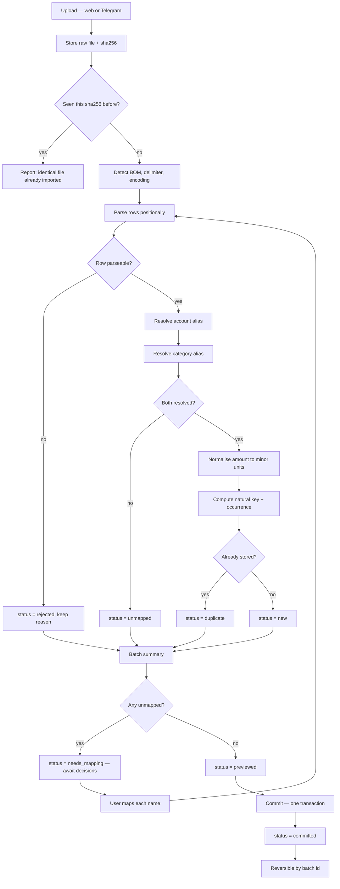
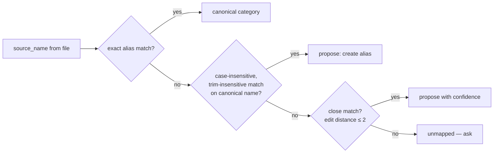
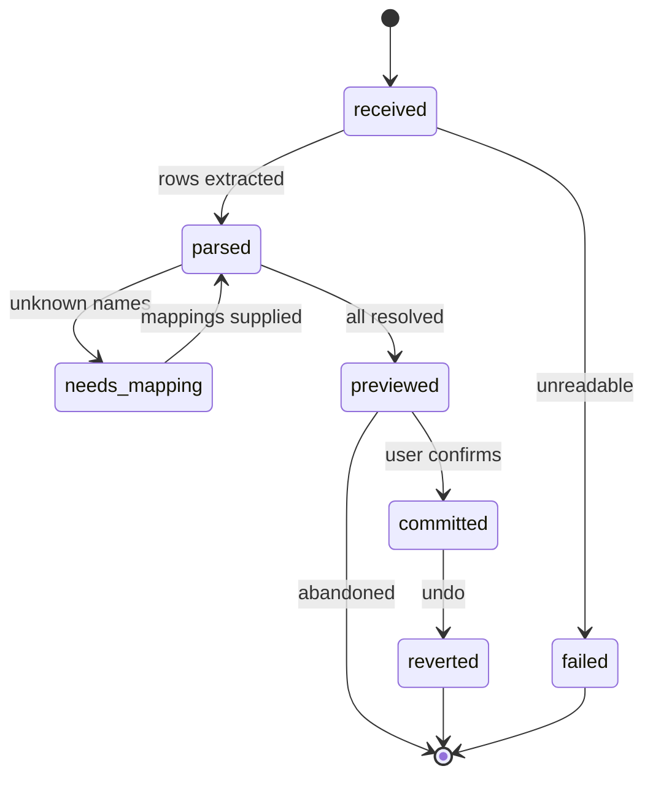

# 04 — Monefy Import

Written against a real export: `monefy-2023-12-03_03-48-39.csv`, 1,683 data rows, 19.07.2021 → 03.12.2023.

## 4.1 File format — verified, not assumed

```
date,account,category,amount,currency,converted amount,currency,description
19.07.2021,UAH,Utilities,-65,UAH,-65,UAH,Коммисия
20.07.2021,UAH,Food,-44,UAH,-44,UAH,"Продукты "
03.12.2023,EUR,Eating out,-10,EUR,-397.3,UAH,
03.12.2023,HUF,Communication,-1000,HUF,-100,UAH,
```

| Property | Observed value | Consequence |
| --- | --- | --- |
| Encoding | **UTF-8 with BOM** (`EF BB BF`) | Strip the BOM or the first header becomes `date`. |
| Delimiter | `,` | Sniff anyway; a semicolon locale is plausible. |
| Header | `currency` appears **twice** | **Header-name maps are impossible.** Address columns positionally. |
| Date | `DD.MM.YYYY` — dots | The existing parser expects `M/D/YYYY` slashes and `log.Fatal`s. |
| Time | none | Date-only attribution; timezone is irrelevant for a transaction. |
| Transaction ID | none | Dedup must be structural. §4.5. |
| Type column | none | Sign carries it. All 1,683 rows are negative. |
| Income | **zero rows** | Monefy does not export income here. §4.8. |
| `account` | `UAH` ×1681, `EUR` ×1, `HUF` ×1 | Accounts named after currencies, so redundant with `currency` — but not for other users. |
| Cols 4–5 | native amount + currency | **Authoritative.** |
| Cols 6–7 | amount converted to Monefy's base at export time — here **UAH** | **Discarded.** §4.4. |
| `description` | may be empty, quoted, with trailing spaces | Trim for display, preserve raw for the natural key. |
| Coverage | full history, every export | Re-import overlap is the normal case. §4.6. |

### Locale drift

The three older exports in `data/` are **Russian**: `Наличные` (Cash), `Счета` (Bills). Monefy exports in the **device locale**, and accounts and categories were renamed between exports. So the importer must handle:

- the same logical category under different names across files;
- the same logical account renamed mid-history;
- both resolved through the alias table rather than by guessing.

## 4.2 The bug this design exists to prevent

The current parser looks up 18 hardcoded keys. Real names differ, so **≈237 of 1,683 rows (14%)** become zero with no warning:

| CSV has | Parser wants | Lost |
| --- | --- | --- |
| `Utilities` | *nothing* | 119 |
| `HotelTrip` | `Hotel/Trip` | 58 |
| `Communication` | `Communications` | 25 |
| `Clouth` | `Clothes` | 19 |
| `Studing` | `Studying ` | 12 |
| `Sport` | `Sports` | 3 |
| `Taxi` | *nothing* | 1 |

**Therefore: an unrecognised category stops the batch.** It is never auto-created, never coerced, never zero. Silent auto-creation is how `Utilities` vanished; silent lookup failure is how `Communication` did.

## 4.3 Pipeline



## 4.4 Amounts

**Native is authoritative.** Column 6 is Monefy's own conversion into whatever base it had at export time — UAH in this file, while the reporting base is EUR. It is neither stable across exports nor in the currency needed, so it is parsed for diagnostics and otherwise dropped.

Normalisation:

1. Strip sign; record `kind` from it. `-65` → `expense`, `amount_minor = 6500` for a 2-decimal currency.
2. **Never `amount[1:]`.** Parse the signed decimal properly. The existing shortcut turns a positive `450` into `50`; it survives only because no income is exported.
3. Scale by the currency's exponent from the `currency` table — HUF is **0-decimal**, so `-1000 HUF` is `amount_minor = 1000`, not `100000`.
4. `base_amount_minor` computed by us at the rate for `occurred_on`, with `fx_rate_id` recorded. If no rate exists for that date, use the nearest earlier rate and record which. If none exists at all, leave base `NULL` — a missing rate must not block ingestion.

## 4.5 Deduplication

No ID, no time, full-history re-exports. Two genuinely distinct rows can be byte-identical: two coffees, same day, same price, same category, same empty description. A plain content hash would discard the second — real data loss.

```
natural_key = SHA256( occurred_on | account_source_name | category_source_name
                      | amount_minor | currency | raw_description )
occurrence  = 1-based index within (natural_key) for that date
```

`UNIQUE (user_id, natural_key, occurrence) WHERE deleted_at IS NULL` makes this a database invariant.

Worked example — three identical rows on one date:

| Import | File contains | Stored | Result |
| --- | --- | --- | --- |
| 1st | 2 identical | occurrence 1, 2 | 2 inserted |
| 2nd (same file) | 2 identical | occurrence 1, 2 | 0 inserted, 2 duplicates |
| 3rd (a third coffee added) | 3 identical | occurrence 1, 2, 3 | 1 inserted, 2 duplicates |

Correct in all three cases. Neither content hashing nor append-only achieves this.

## 4.6 Full-dataset reconcile

Because every export is complete history, import is a **reconcile**, not an append:

- rows in the file, not in the database → **insert**
- rows in both → **skip**, counted as duplicates
- rows in the database for a date range the file covers, but absent from the file → **flag as vanished**, never auto-delete

The third case matters: it catches a transaction deleted in Monefy after a previous import. Auto-deleting would make a parsing bug destructive, so it is reported and the user decides.

Reconcile is scoped to `[min(date), max(date)]` of the file, so a partial export can never imply that everything outside its range is gone.

## 4.7 Alias resolution



Fuzzy matching only ever **proposes**; it never applies. Confirmation is required, and once given the alias is permanent and that name never asks again.

The threshold is **two edits, and a third once the longer name reaches seven characters**. `Clouth` → `Clothes` is the exemplar and is distance **3**, not the 2 this document claimed before the code was written (`clo|uth` vs `clo|thes`: drop `u`, add `e`, add `s`); every other misspelling in the observed data is 1 or 2. Short names stay at two edits, because at four characters three edits is a different word.

### Seeded aliases

From the observed data, so a first import of this file needs almost no decisions:

| `source_name` | Canonical |
| --- | --- |
| `HotelTrip`, `Hotel/Trip` | `Hotel/Trip` |
| `Communication`, `Communications` | `Communications` |
| `Clouth`, `Clothes` | `Clothes` |
| `Studing`, `Studying`, `Studying ` | `Studying` |
| `Sport`, `Sports` | `Sport` |
| `Toiletry`, `Toilery` | `Toiletry` |
| `Applience`, `Appliance` | `Appliances` |
| `Family`, `Family ` | `Family` |
| `Счета` | `Bills` |
| `Наличные` | account → `Cash UAH` |

`Utilities` and `Taxi` are created as **real categories** — they had no spreadsheet row, which is why 120 rows had nowhere to go. Whether they instead fold into `Bills` and `Transport` is a one-line alias change.

Canonical spellings are corrected (`Appliances`, `Toiletry`) with the misspellings retained as aliases, so both the file and the old spreadsheet keep resolving.

## 4.8 Income

Monefy exports **no income** — 0 of 1,683 rows positive. Income currently reaches the spreadsheet by being typed into the formula bar (`=3186+183+200+86`).

So income entry is a **v1 requirement**, not an optional extra, and it needs line items — source, amount, date, category — rather than one number per month. Otherwise `Diff` and `Saved %` cannot be computed at all.

If a future export does contain positive rows, they import as `income` with no code change; the sign already drives `kind`.

## 4.9 Transfers

None appear in this export. If transfers are used in Monefy and simply absent from the export, they are invisible to import and must be entered in the app. Documented as a known unknown rather than assumed away — see Q131″ in the planning catalogue.

## 4.10 Batch states



Commit is a single SQL transaction: insert rows, set `import_batch_id`, update counts, set `committed_at`. Revert soft-deletes exactly the rows carrying that `import_batch_id` — which is why every transaction records the batch that produced it.

## 4.11 Preview payload

First import of the real file — every row lands, which is the whole point. `months_touched` counts the distinct months that actually contain rows: 28, because 2022-08 and 2022-09 are empty. (An earlier draft said 29; the file says otherwise.)

```json
{
  "batch_id": 1,
  "filename": "monefy-2023-12-03_03-48-39.csv",
  "date_range": { "from": "2021-07-19", "to": "2023-12-03" },
  "rows_total": 1683,
  "rows_new": 1683,
  "rows_duplicate": 0,
  "rows_unmapped": 0,
  "rows_rejected": 0,
  "months_touched": 28,
  "unmapped_categories": [],
  "unmapped_accounts": [],
  "vanished": [],
  "by_currency": { "UAH": 1681, "EUR": 1, "HUF": 1 },
  "warnings": [
    "No income rows found. Income must be entered manually.",
    "Monefy converted-amount column is in UAH; ignored in favour of native amounts."
  ]
}
```

Re-importing the same export the following month, with 40 new transactions since:

```json
{
  "batch_id": 2,
  "rows_total": 1723,
  "rows_new": 40,
  "rows_duplicate": 1683,
  "rows_unmapped": 0,
  "rows_rejected": 0,
  "vanished": []
}
```

Had the file arrived before any aliases were seeded, the first attempt would instead report `rows_unmapped: 237` across seven names and commit **nothing** — the same 237 rows the current pipeline discards silently.

## 4.12 Other sources

The pipeline is generic; only the parser is Monefy-specific. A `Source` implementation provides column positions, date layout and sign convention. A generic column-mapping UI for arbitrary CSVs is designed for but deferred past v1.

## 4.13 Retention

Raw uploads are kept under `/config/uploads/<user>/<sha256>` so a batch can be re-processed after an importer fix without re-exporting from the phone. Deleting a batch deletes its file. Files are plaintext, consistent with [adr/0002](adr/0002-no-encryption.md).

The digest is also the re-upload guard. Uploading a file whose sha256 was already **committed** returns that original batch with `already_imported: true` and reprocesses nothing — there is no second opinion to be had about identical bytes. A file that was reverted is not committed, so re-uploading it works normally. A *fresh export* covering the same history is different bytes and is analysed in full, which is the case that reports `rows_new: 0, rows_duplicate: 1683`.

## 4.14 Test corpus

`testdata/` carries the real export and targeted fixtures:

| Fixture | Asserts |
| --- | --- |
| `monefy-real-1683.csv` | Full parse; exactly 1,683 rows; 0 unmapped after seeding |
| `bom-crlf.csv` | BOM stripped; CRLF tolerated |
| `duplicate-header.csv` | Both `currency` columns addressed positionally |
| `identical-rows.csv` | 3 identical rows → occurrences 1, 2, 3 |
| `reimport-same.csv` | Second run inserts 0 |
| `huf-zero-decimal.csv` | `-1000 HUF` → `amount_minor = 1000` |
| `positive-amount.csv` | Income parsed; guards against the `amount[1:]` bug |
| `russian-locale.csv` | `Наличные` / `Счета` resolve via aliases |
| `unknown-category.csv` | Batch enters `needs_mapping`, inserts nothing |
| `dotted-date.csv` | `DD.MM.YYYY` accepted; `M/D/YYYY` rejected loudly |
| `vanished-row.csv` | Prior row absent from range → flagged, not deleted |

The first fixture is the regression test for the 14% loss: it must import **1,683** rows, and a run that yields 1,446 is a failure.
