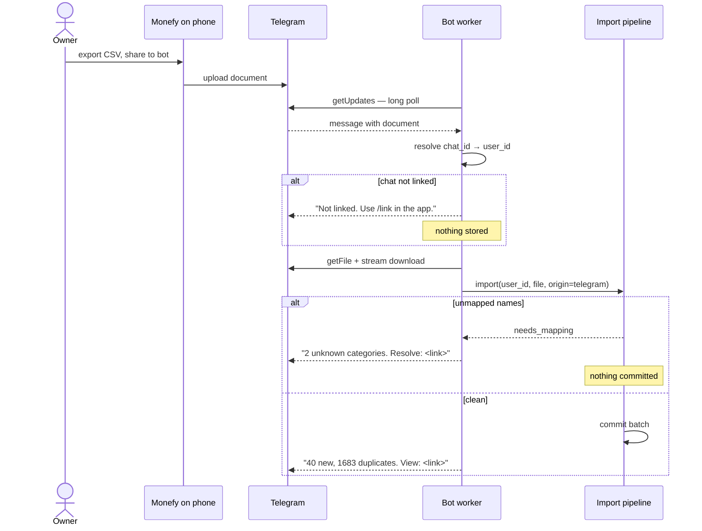
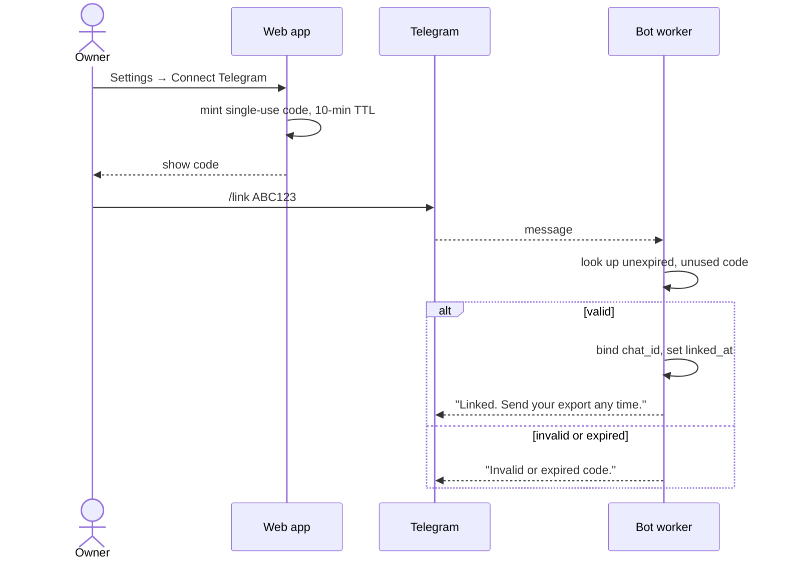

# 05 — Telegram Bot

## 5.1 Scope

**The bot does one job: receive a Monefy export and hand it to the importer.**

That is the whole feature. It is not a second interface to the app, it is not a chat assistant, and it is deliberately not a reimplementation of the old bot. It is **optional** — one config key, disabled by default — and a deployment without it is fully functional via web upload.

## 5.2 Why it exists at all

The value is narrow and specific: **the phone never has to reach the server.** Monefy's share sheet sends the CSV to Telegram, and the server pulls it from Telegram's API. No transferring a file to a computer first, no inbound endpoint, no VPN, works on any network.

That is worth keeping. Everything beyond it is not.

## 5.3 Deliberately not built

The old bot grew into a small application: it parsed, aggregated, formatted a report, wrote to a spreadsheet, and replied with two message bodies. This one does not.

| Not built | Why |
| --- | --- |
| Report and summary commands (`/status`, `/balance`, `/spend`) | The app shows this better. Duplicating it means two renderers of the same numbers, drifting apart. |
| Quick expense entry by message | Free-text amount parsing is a new failure surface. Quick entry is three taps in the PWA. |
| `/undo` | Reverting an import is a decision that deserves the preview screen, not a chat confirmation. |
| Scheduled notifications | A separate concern with its own delivery, retry and opt-out surface. Not part of ingestion. |
| Aggregating or formatting in the bot | The old bot's job. Aggregation belongs in the metrics layer, once. |
| Writing anywhere but through the importer | The old bot wrote 18 positional values into fixed cells. That coupling is the source of several defects. |

If the app proves inconvenient in a way a bot command would fix, that is evidence to revisit — not a reason to build it up front.

## 5.4 Commands

Four, of which one is the point.

| Command | Behaviour |
| --- | --- |
| *document upload* | Import. The entire purpose. |
| `/link <code>` | Bind this chat to a user. |
| `/unlink` | Revoke this chat. |
| `/help` | These four lines. |

## 5.5 Ingestion



The bot's own logic ends at "hand the bytes to the importer and relay one reply". Parsing, aliasing, dedup, reconcile and commit are all [04](04-import-monefy.md), shared with web upload — one code path, one set of tests.

The unmapped branch matters: the old bot would silently zero those rows. This one commits nothing and replies with a link.

## 5.6 Linking

An unlinked chat can do nothing except ask to be linked.



- Single-use, 10-minute TTL, cryptographically random.
- One live link per `chat_id`, enforced by a partial unique index.
- Revoking in the app cuts the chat off immediately.
- `/link` attempts are rate-limited per chat, so codes cannot be guessed.
- An unlinked chat gets one instructional reply and is otherwise ignored — no signal about whether a code exists.

## 5.7 Reliability

The worker is a supervised goroutine and must never take down the HTTP server.

- Panics recovered **per update**, logged with the update ID; the loop continues.
- Poll failures back off exponentially 1s → 60s with jitter, logged once per transition rather than per attempt.
- The poll offset is **persisted**, so a restart neither replays nor skips. Telegram buffers while the app is down, so a file sent during a deploy still arrives.
- Downloads capped at Telegram's 20 MB `getFile` limit and streamed to `/config/uploads`, never buffered in memory. The largest observed export is 76 KB.

## 5.8 Configuration

```yaml
telegram:
  enabled: false       # opt-in
  token: ""            # env: MONEYAPP_TELEGRAM_TOKEN
  max_file_bytes: 20971520
```

Three keys. **Long-polling only** — webhook mode is not implemented, because it would require a routable HTTPS endpoint and reverse-proxy configuration to save a few seconds of latency on a monthly upload.

Boot fails fast if `enabled: true` and the token is empty, rather than starting a bot that silently cannot poll.

For multiple users, **one bot** serves everyone; `chat_id` → `user_id` linking does the isolation. Per-user tokens would put per-user secrets in shared config for no isolation benefit.

## 5.9 Security

- **Rotate the existing token.** It is a literal in the old `main.go:19` and is in git history.
- Token from config or environment only, never a source default, and redacted in all logs — including the download URL, which embeds it.
- Uploaded files are untrusted input: size-capped, streamed, parsed as CSV only, never touching a shell.
- **Telegram sees every uploaded file.** Inherent to the transport, and accepted — consistent with [adr/0002](adr/0002-no-encryption.md). Anyone unwilling to accept it leaves `enabled: false` and uses web upload, which is why the bot is opt-in rather than default-on.

## 5.10 Faults fixed from the old bot

| Old | New |
| --- | --- |
| Any chat could write to the spreadsheet | Chat must be linked; unlinked refused |
| One month per run, month from `os.Args` | All months derived from the file, one pass |
| 18 positional values into fixed cells | Normal import pipeline, no positional coupling |
| Rates read once at boot | Read per request from the database |
| `recover()` with `err` read before assignment | Supervised worker with real error reporting |
| Live token as a source constant | Config or environment only |
| Unmapped categories silently zeroed | Batch blocked, reply links to the mapping screen |
| Parsing, aggregation, formatting and sheet-writing all in the bot | Bot relays bytes and one reply; everything else is shared |
