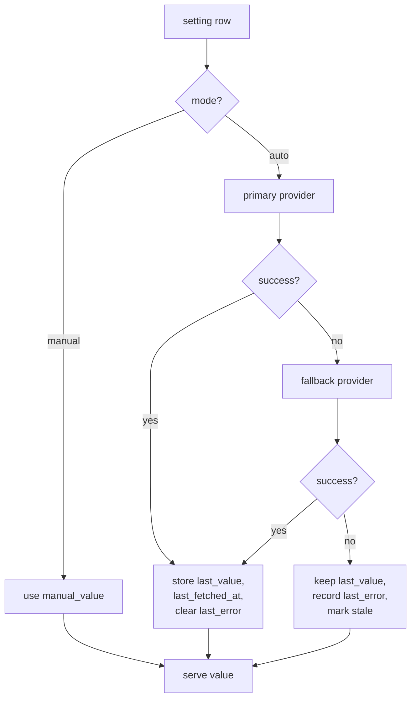

# 06 — FX Rates, Prices and Value Providers

## 6.1 The problem

The spreadsheet holds four hand-typed rates with **no date**:

| Cell | Setting | Value |
| --- | --- | --- |
| `E2` | `EUR/USD` | 1.14 |
| `E3` | `USD/EUR` | 0.88 |
| `E4` | `HUF/EUR` | 0.0028 |
| `E5` | `UAH/EUR` | 0.02 |

Three consequences:

1. **Redundant and already inconsistent.** `1 ÷ 1.14 = 0.8772`, not `0.88`. Two numbers for one fact, drifting.
2. **`EUR/USD` is never referenced by any formula.** Only `E3`, `E4`, `E5` are used. Dead data.
3. **No date means history is rewritten.** Every past snapshot is revalued at today's rate, so `Diff in real capital` silently blends real saving with currency movement.

The `Month = 12` setting in `G2` is also referenced by nothing.

## 6.2 Provider research

Tested live on 2026-07-29. Not quoted from documentation.

| Provider | Key | UAH | HUF | XAU | Crypto | Count | Verdict |
| --- | --- | --- | --- | --- | --- | --- | --- |
| `open.er-api.com` | none | ✅ | ✅ | ✗ | ✗ | 161 | **Primary** |
| `fawazahmed0/currency-api` via jsDelivr | none | ✅ | ✅ | ✅ | ✅ | 338 | **Fallback + metals/crypto** |
| Frankfurter / ECB | none | ❌ | ✅ | ✗ | ✗ | 30 | **Rejected** |
| DuckDuckGo Instant Answer | none | ❌ | ❌ | ✗ | ✗ | — | **Rejected** |

### Why Frankfurter is rejected

Frankfurter serves ECB reference rates, which cover 30 currencies. **UAH is not among them.** Confirmed by fetching `/v1/currencies`: the list runs AUD…ZAR with no UAH. Since UAH is one of four required currencies, ECB cannot be the primary source. It remains usable as a third opinion for EUR, USD and HUF.

### Why DuckDuckGo is rejected

Requested explicitly, so it was tested:

```
GET https://api.duckduckgo.com/?q=1+EUR+to+UAH&format=json&no_html=1
→ Answer: ""   AbstractText: ""   AnswerType: ""
→ "production_state": "offline", "dev_milestone": "development"
```

The currency-conversion Instant Answer is not in production. The endpoint returns metadata about itself and no rate. It is not a currency API and cannot be used as one.

### Validation of existing rates

The chosen providers agree with the hand-maintained numbers, which confirms the direction convention `X/EUR = 1 ÷ (EUR→X)`:

| Sheet | Manual | `open.er-api` | `fawazahmed0` |
| --- | --- | --- | --- |
| `EUR/USD` | 1.14 | 1.138108 | 1.13964 |
| `HUF/EUR` | 0.0028 | 0.0027746 | 0.0027710 |
| `UAH/EUR` | 0.02 | 0.0195771 | 0.0195156 |

### Metals and crypto

`fawazahmed0` includes `XAU` at `0.0002829015` per EUR — about **3,535 EUR per troy ounce**. So `Gold` can be a quantity priced daily instead of a number retyped monthly.

`USDT` is present at `1.140992` per EUR. `TON` is **absent** under that ticker; if TON tracking is revived it needs a different source or ticker.

## 6.3 Storage

One direction only. `EUR→X` is stored; the inverse is computed. This structurally eliminates the `1.14` / `0.88` inconsistency.

```sql
-- rate as TEXT decimal, parsed into big.Rat. No binary float anywhere.
INSERT INTO fx_rate (as_of_date, base, quote, rate, source, fetched_at)
VALUES ('2026-07-29', 'EUR', 'UAH', '51.080258', 'open.er-api.com', '2026-07-29T00:31:02Z');
```

`UNIQUE (as_of_date, base, quote, source)` allows two providers to hold an opinion for the same day without conflict; resolution is by `provider.priority`.

### Lookup

`RateOn(base, quote, date)`:

1. Exact `as_of_date` match from the highest-priority enabled provider.
2. Otherwise the nearest **earlier** date — never a later one, so a historical figure never changes because of a future rate.
3. Otherwise `NULL`, and the caller reports the value as unconvertible rather than guessing.

Cross rates go through the base: `USD→HUF = (EUR→HUF) ÷ (EUR→USD)`, computed in `big.Rat`, rounded once at the end.

## 6.4 Generalised value providers

FX is not special-cased. Any numeric setting is either `manual` or `auto`, with a provider behind `auto`. The same mechanism serves rates, metal prices and crypto prices.



Guarantees:

- **A provider failure is never fatal.** The last known value keeps serving; the UI shows its age.
- **A manual override always wins.** Switching a setting to `manual` freezes it. The UI shows both: "auto suggested 51.08, you set 51.00".
- **Nothing blocks on the network.** Rendering never waits on a provider; the scheduler is the only caller.

### Registry

| Setting key | Default mode | Provider | Notes |
| --- | --- | --- | --- |
| `fx.EUR_USD` | auto | `open.er-api` | |
| `fx.EUR_HUF` | auto | `open.er-api` | |
| `fx.EUR_UAH` | auto | `open.er-api` | Frankfurter cannot serve this |
| `price.XAU` | manual | `fawazahmed0` | Auto once gold quantity is known |
| `price.USDT` | manual | `fawazahmed0` | |
| `threshold.warn_percent` | manual | — | Sheet `C2` = 10 |
| `threshold.over_multiplier` | manual | — | Sheet's hardcoded 2× |
| `report.base_currency` | manual | — | EUR |
| `report.fiscal_year_start` | manual | — | 8, from the Aug→Jul layout |

Thresholds live in the same table as rates. One settings screen, one mechanism, one audit trail.

## 6.5 Scheduling

Daily. `open.er-api.com` publishes `time_next_update_utc`, so the next run is scheduled from the provider's own answer rather than a fixed guess.

- On boot, refresh anything older than its interval — a container restart does not skip a day.
- Jittered start to avoid hammering a free endpoint at exactly midnight.
- One row per `(date, pair, source)`; re-running is idempotent.
- Weekend and holiday gaps are normal for FX. The nearest-earlier lookup handles them; they are not treated as errors.

## 6.6 Historical valuation

Two modes, because they answer different questions:

| Mode | Behaviour | Use |
| --- | --- | --- |
| **Contemporaneous** (default) | Each snapshot valued at its own month's rate | Truthful history. `Diff in real capital` becomes meaningful. |
| **Constant** | Everything valued at today's rate | Reproduces the current spreadsheet. Answers "what is my history worth in today's money?" |

A display toggle, not a stored difference — both are derived from the same rows.

Contemporaneous valuation is what allows the change in net worth to be split:

```
Δ total     = General(t) − General(t−1)
Δ real      = Σ over accounts of (quantity_t − quantity_{t−1}) × rate_t
Δ fx        = Δ total − Δ real
```

The spreadsheet's row 59 conflates these. Splitting them is the single largest analytical improvement available, and it is only possible because rates are dated.

## 6.7 No broker integration

Investment values are entered manually, like every other snapshot.

The old parser carried an unused `internal/trading212/` package that could fetch broker cash and portfolio, and rows 50–51 (`Invests`, `Invested`) are maintained as inline arithmetic that the API would have populated. It is **dropped** — not deferred. No `broker` provider kind exists, no API key is configured, and `internal/provider/` contains only the two FX sources.

Consequences, accepted:

- `Invests` and `Invested` are typed monthly, along with every other account. The snapshot screen pre-fills last month's figure, so it is confirm-or-adjust.
- Profit and loss still works: `value − cost_basis_minor`, both entered by hand.
- One fewer third-party dependency, one fewer credential, one fewer outbound call.

**The exposed Trading212 key should still be revoked**, independently of this decision — it is a literal in the old `main.go` and is in git history, and it grants read access to real account and portfolio data. Since nothing will use it, revoking outright is simpler than rotating.

## 6.8 Failure behaviour

| Failure | Response |
| --- | --- |
| Primary provider 5xx or timeout | Try fallback |
| Both fail | Keep last value, set `last_error`, badge as stale |
| Malformed payload | Reject wholesale; never partially apply a response |
| Rate implausible vs last known | Reject and flag — guards against a provider serving a decimal-shifted value |
| No rate for a requested date | Nearest earlier; if none, report unconvertible |
| Network disabled entirely | Everything works on manual values |

The plausibility check matters: a silently wrong rate corrupts every derived figure, and a 10× error would otherwise look like a real event.

## 6.9 Open item

**`TODO(anatol)` — gold quantity.** `Gold = 3000` EUR is a value, not a holding. Switching to live `XAU` pricing needs the quantity and unit. At the tested price of ~3,535 EUR/oz, 3,000 EUR is roughly 0.849 troy ounces or ~26.4 g, but that is inference from a possibly stale valuation, not a fact. Until supplied, `price.XAU` stays `manual` and `Gold` keeps its asserted value.
