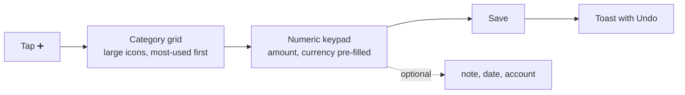
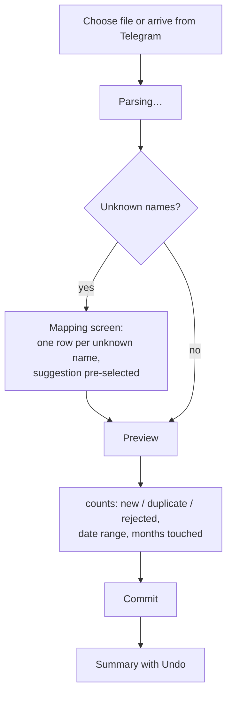

# 08 — UX and PWA

## 8.1 Principles

1. **Recording a spend must be trivial.** If the app is to stand in for Monefy, entry has to be ≤3 taps. Everything else can cost a tap more.
2. **The dashboard answers three questions:** Am I on budget this month? What is my net worth? How long would my money last?
3. **Absent is not zero.** A month with no data reads as blank, never `0` and never `-1`.
4. **Colour is never the only signal.** Every budget state carries an icon and a label.
5. **Desktop is not a stretched phone.** Phone is entry-first; desktop is dashboard-first.

The attached mockup — purple gradient, card layout, hero amount, gradient area chart, bottom tab bar, per-row progress bars — is **loose inspiration**, not a pixel target. Adopted: the card rhythm, the hero figure, the gradient area chart, per-category progress rows with percentages. Rejected: its `Payments`, `Cards` and `Country` tabs, which map to nothing in this data.

## 8.2 Navigation

Mobile — bottom tab bar, four items plus a central action:

| Tab | Purpose |
| --- | --- |
| **Budget** | Current month: hero spend, plan vs actual per category |
| **Capital** | Net worth, allocation, runway |
| **➕** | Quick entry — centre, raised, always reachable |
| **History** | Transaction list, search, filter |
| **More** | Import, settings, categories, accounts |

Desktop — left sidebar, same destinations, with a multi-widget dashboard as the landing view.

## 8.3 Quick entry

The one flow that must be fast.

- Categories ordered by **recent frequency**, so the common six are always on the first screen without scrolling.
- Amount keypad is a custom grid, not the OS keyboard — no zoom, no layout shift, bigger targets.
- Date defaults to today; account to the last used for that currency.
- Save is optimistic with an Undo toast. A failure restores the draft rather than discarding it.
- Note, date and account are one tap away, never in the required path.

Three taps: category, digits, save.

## 8.4 Budget screen

- **Hero:** month-to-date spend, with planned total beneath and a progress ring.
- **Secondary:** `Diff` — left to spend — and `Saved %`.
- **Gradient area chart:** daily cumulative spend against a straight-line plan, so pace is visible. This is the mockup's chart, given a purpose.
- **Category rows:** icon, name, actual, planned, percentage, progress bar coloured by the §7.6 precedence, with icon and label.
- **Swipe left/right** changes month. Incomplete months are marked, not zeroed.
- Tapping a category drills into its transactions.

## 8.5 Capital screen

- **Hero:** net worth in base currency, with the month's change split into **real** and **FX** — the [07](07-metrics-and-budgets.md) §7.5 improvement made visible, since it is the number the spreadsheet could never show.
- **Runway:** "7.1 months at current burn", with the burn definition named and switchable.
- **Allocation doughnut:** leaf accounts only, grouped by asset class, drill-down on tap. Percentages sum to 100%.
- **Account list:** grouped by asset class, native amount and base value, liquid marked.
- **Snapshot entry:** one screen per month listing every account with last month's figure pre-filled, so recording is confirm-or-adjust rather than retype. This replaces roughly 30 manual cells.
- **Drift:** where transactions imply a different balance, the difference is shown as an informational badge. The snapshot is always authoritative; nothing is auto-corrected.

## 8.6 Import

The mapping screen is the antidote to the 14% loss: unknown names are **unmissable and blocking**, with a fuzzy suggestion pre-selected but requiring confirmation. Batch history lists every import with counts and a revert action.

## 8.7 Settings

One screen, one mechanism for everything ([06](06-fx-and-providers.md) §6.4). Each numeric setting shows:

- current value and whether it is **manual** or **auto**
- for auto: provider, last fetch, staleness badge, last error
- for overridden: "auto suggested 51.08 — you set 51.00", with a reset

Grouped: **Currencies** (rates, base currency), **Prices** (gold, crypto), **Thresholds** (warn %, over multiplier), **Periods** (fiscal year start), **Integrations** (Telegram), **Account** (password, sessions, export).

## 8.8 Categories and accounts

Categories: name, icon, colour, expense/income, **essential** toggle (drives `Possible Minimum`), sort order, archive. Drag to reorder. Archiving preserves history; the category disappears from entry but historical rows keep it. Renaming keeps identity, so history follows the new name. Merging rewrites transactions and leaves an alias behind.

Accounts: name, asset class, currency, **liquid** toggle, **counts toward net worth** toggle, optional price ticker and cost basis, parent. Parents are computed and cannot hold a value directly.

Both screens expose the alias table, so a mapping decision made during import is visible and editable afterwards.

## 8.9 PWA

`manifest.json` with name, icons (192/512, maskable), `display: standalone`, theme colour, `start_url: /`.

Service worker caches the **app shell only** — HTML, JS, CSS, fonts, icons — cache-first with a network-first fallback for navigation. API responses are not cached.

### iOS limitations, stated plainly

| Limitation | Handling |
| --- | --- |
| Install is manual — Share → Add to Home Screen | A dismissible one-time instruction with a diagram, shown only on iOS Safari |
| No push notifications unless installed | Accepted. Nothing in v1 depends on push — the bot deliberately does not send notifications either ([05](05-telegram-bot.md) §5.3) |
| No Background Sync | Not relied upon |
| Storage evictable after ~7 days unused | Only the shell is cached, so eviction costs one reload, never data |

Android installs via the standard prompt. A TWA wrapper is possible later but adds nothing while the PWA suffices.

### Offline

**Deferred** ([adr/0012](adr/0012-defer-offline-entry.md)). The shell loads offline and shows a clear offline state; data requires a connection. Offline writes would need a client mutation queue, conflict resolution across devices, and duplicate client-side money and FX logic — the largest single cost on the client, for a workflow that currently does one bulk import a month. Revisit if the PWA genuinely replaces Monefy for daily entry.

## 8.10 Visual system

- **Dark mode follows the system**, with a manual override. Dark is the primary design target, matching `upmonitor`.
- The sheet's pastels (`#F19189`, `#FCE8B2`, `#B7E1CD`) are remapped for dark mode; hue meaning is preserved, lightness and saturation are not.
- Tabular figures for all money, right-aligned, per-currency decimals — HUF shows none.
- Large numbers grouped by locale; 4,562,000 HUF must be readable at a glance.
- Charts: ECharts, gradient area fills, month-labelled x-axes (the sheet's charts plotted against a bare index), and **incomplete months excluded** rather than plunging to zero as all three sheet charts do.

## 8.11 Accessibility

WCAG 2.1 AA as the target: 4.5:1 text contrast, ≥44px touch targets, full keyboard reachability with visible focus, `aria-live` on save and import outcomes, `prefers-reduced-motion` honoured, and no meaning conveyed by colour alone.

## 8.12 Empty states

First run is guided: create categories from a suggested set → set budgets (one figure per category, applied to all months) → add accounts → first import or first transaction. Every empty screen offers its next action rather than showing a blank card.

## 8.13 Internationalisation

English only in v1, but no hardcoded strings — all copy through an i18n layer, with dates, numbers and currencies formatted per locale. Ukrainian and Hungarian are the likely first additions given the currency set; the existing data already contains Cyrillic descriptions, so the UI must render them correctly from day one regardless of UI language.
