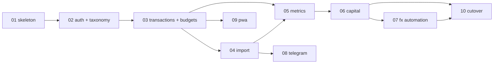

# Implementation Plan

Ten stages. **Every stage ends with a deployable, demonstrable application** — never a half-built layer waiting on the next stage to become useful.

Read [00-conventions.md](00-conventions.md) first. It is the shared contract every stage assumes: layering rules, the `Money` type, error handling, testing patterns, and the commands used to verify work. Each stage file then stands alone as a complete work order.

## Stages

| # | Stage | What works at the end |
| --- | --- | --- |
| [01](01-walking-skeleton.md) | Walking skeleton | `docker run` serves a page and `/healthz`. Migrations run. CI is green. |
| [02](02-auth-and-taxonomy.md) | Auth & taxonomy | Log in; create the 18 categories and every account. Setup is complete. |
| [03](03-transactions-and-budgets.md) | Transactions & budgets | **A usable expense tracker.** Log spend in 3 taps, set budgets, browse history. |
| [04](04-monefy-import.md) | Monefy import | **Your 1,683 real transactions are in the system**, with zero silent loss. |
| [05](05-metrics-and-budget-report.md) | Metrics & budget report | The spreadsheet's **budget half** reproduced and parity-tested. |
| [06](06-capital-and-net-worth.md) | Capital & net worth | The spreadsheet's **capital half** reproduced. **The workbook is now fully replaced.** |
| [07](07-fx-automation.md) | FX automation | Rates update themselves daily. Historical valuation becomes honest. |
| [08](08-telegram-bot.md) | Telegram bot | Forward an export from the phone; it imports. |
| [09](09-pwa-and-polish.md) | PWA & polish | Installs on the home screen. Dark mode, accessibility. |
| [10](10-migration-and-cutover.md) | Migration & cutover | Historical data loaded, backups running, spreadsheet retired. |

## The two gates

Two tests are absolute. They fail the build, and no stage is done while either is red.

**Import fidelity** (from [04](04-monefy-import.md)) — the real export must yield **exactly 1,683** stored rows. A run producing 1,446 is the 14% silent loss regressing.

**Excel parity** (from [05](05-metrics-and-budget-report.md) and [06](06-capital-and-net-worth.md)) — every metric matches the workbook, except the ten documented deviations in [appendix-excel-parity.md](../appendix-excel-parity.md).

## Dependencies

Stages 8 and 9 are independent of 5–7 and can be taken out of order once their prerequisite lands.

## Working a stage

Each file contains, in order: **Goal**, **MVP demo** (what to show a human), **Scope in/out**, **Contracts** (exact signatures other stages depend on), **Tasks** (numbered, granular), **Tests**, **Verification** (commands with expected output), and **Done checklist**.

Every stage file opens with a **Kickoff prompt** — paste it to start that stage cold.

Rules that hold across all stages:

1. **Never break a previous stage's demo.** The stage-N demo must still pass at stage N+5. CI keeps every prior stage's acceptance test.
2. **Scope out is binding.** If something is listed as out of scope, it belongs to a later stage. Note it and move on.
3. **A stage is not done until its verification commands pass** on a clean checkout, from `docker compose up`.
4. **Contracts are frozen once published.** Changing a signature another stage depends on means updating that stage's file in the same commit.

## Source specification

The plan implements [../README.md](../README.md) and does not restate it. When a task needs the *why*, the stage file links the section. Notable ones:

- [03-data-model.md](../03-data-model.md) — the DDL is authoritative; migrations transcribe it
- [04-import-monefy.md](../04-import-monefy.md) — verified CSV format, alias table, dedup algorithm
- [07-metrics-and-budgets.md](../07-metrics-and-budgets.md) — every formula, unambiguously
- [appendix-excel-parity.md](../appendix-excel-parity.md) — the acceptance criteria and the ten deviations
- [adr/](../adr/) — thirteen decisions with rationale; do not relitigate them mid-stage

## Open questions carried into the build

Two facts were never supplied and are marked `TODO(anatol)` in the spec. Neither blocks any stage; both leave a value manual until answered.

- **Gold quantity** behind `Gold = 3000` EUR — blocks auto-pricing via `XAU` in stage 07.
- **Income addend composition** (`=3186+183+200+86`) — blocks typed income categories in stage 10's backfill.
